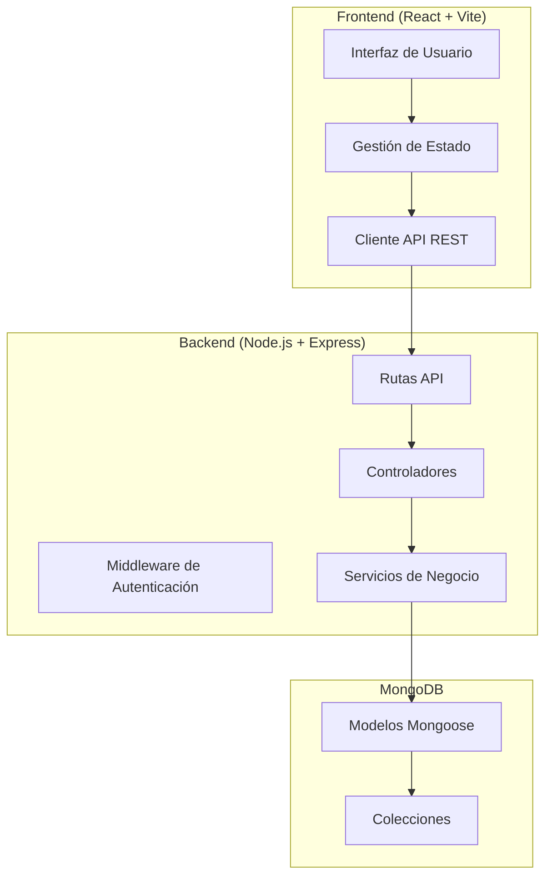
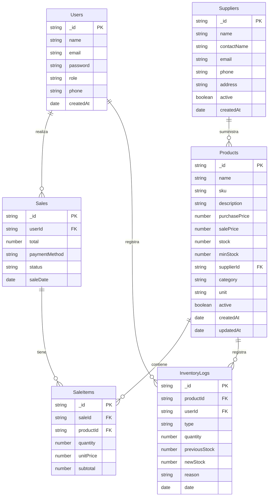

# Plan: Sistema de Administración de Inventarios - Almacén

## 1. Resumen del Proyecto

**Nombre:** InventoryManager - Sistema de Administración de Inventarios  
**Tipo:** Aplicación Web Full Stack  
**Volumen:** Mediano (500-5000 productos)  
**Usuarios objetivo:** Personas no experimentadas con tecnología

### Stack Tecnológico
- **Frontend:** React 18 + Vite + JavaScript
- **Backend:** Node.js + Express
- **Base de Datos:** MongoDB
- **Estilización:** CSS Modules + UI Components personalizados

---

## 2. Arquitectura del Sistema

---

## 3. Estructura de Base de Datos

### Colecciones MongoDB

---

## 4. Módulos de la Aplicación

### 4.1 Dashboard Principal
- Resumen de ventas del día
- Alertas de stock bajo
- Productos más vendidos
- Acceso rápido a funciones principales
- Gráficos simples de ventas

### 4.2 Módulo de Inventarios
- **Gestión de productos:**
  - Agregar/editar/eliminar productos
  - Código SKU automático
  - Categorías personalizables
  - Fotos de productos (opcional)
  - Control de stock mínimo
  
- **Movimientos de inventario:**
  - Entradas por compra
  - Salidas por venta
  - Ajustes de inventario
  - Historial completo por producto

### 4.3 Módulo de Punto de Venta (POS)
- Interfaz intuitiva tipo caja registradora
- Búsqueda rápida de productos por nombre/SKU
- Carrito de compras visual
- Métodos de pago (efectivo, tarjeta, etc.)
- Generación de ticket de venta
- Descuento por producto o total

### 4.4 Módulo de Contabilidad
- **Reportes de ventas:**
  - Ventas por día/semana/mes
  - Ventas por empleado
  - Ventas por categoría
  - Métodos de pago utilizados
  
- **Reportes de inventario:**
  - Valor total del inventario
  - Productos con stock bajo
  - Rotación de productos
  - Historial de movimientos
  
- **Documentos para descargar:**
  - Reporte de ventas (Excel/PDF)
  - Reporte de inventario (Excel/PDF)
  - Balance de productos
  - Estado de resultados básico

### 4.5 Módulo de Empleados
- **Gestión de usuarios:**
  - Crear/editar/eliminar empleados
  - Asignar roles (admin, vendedor, almacenista)
  - Control de acceso por rol
  
- **Roles:**
  - **Admin:** Acceso completo
  - **Vendedor:** Solo POS y ventas
  - **Almacenista:** Solo inventario

### 4.6 Módulo de Proveedores
- **Gestión de proveedores:**
  - Agregar/editar/eliminar proveedores
  - Información de contacto
  - Productos asociados
  - Historial de compras

---

## 5. Interfaz de Usuario (UX)

### Principios de Diseño
- **Simplicidad:** Interfaces limpias, sin saturación de información
- **Intuitividad:** Iconos grandes, etiquetas claras, flujos lógicos
- **Feedback:** Mensajes claros de éxito/error
- **Accesibilidad:** Colores contrastantes, texto legible

### Componentes UI
- Navegación lateral colapsable
- Formularios simples con validación en tiempo real
- Tablas con búsqueda y filtros
- Botones de acción principales destacados
- Alertas visuales para stock bajo

---

## 6. API REST - Endpoints

### Autenticación
- `POST /api/auth/login` - Iniciar sesión
- `POST /api/auth/register` - Registrar usuario (admin)
- `GET /api/auth/me` - Obtener usuario actual
- `POST /api/auth/logout` - Cerrar sesión

### Productos
- `GET /api/products` - Listar productos
- `GET /api/products/:id` - Obtener producto
- `POST /api/products` - Crear producto
- `PUT /api/products/:id` - Actualizar producto
- `DELETE /api/products/:id` - Eliminar producto
- `GET /api/products/low-stock` - Productos stock bajo

### Proveedores
- `GET /api/suppliers` - Listar proveedores
- `GET /api/suppliers/:id` - Obtener proveedor
- `POST /api/suppliers` - Crear proveedor
- `PUT /api/suppliers/:id` - Actualizar proveedor
- `DELETE /api/suppliers/:id` - Eliminar proveedor

### Ventas (POS)
- `GET /api/sales` - Listar ventas
- `GET /api/sales/:id` - Obtener venta
- `POST /api/sales` - Crear venta
- `GET /api/sales/today` - Ventas de hoy

### Inventario
- `GET /api/inventory` - Historial de movimientos
- `POST /api/inventory/adjust` - Ajustar inventario
- `GET /api/inventory/value` - Valor del inventario

### Reportes
- `GET /api/re - Reportports/sales`e de ventas
- `GET /api/reports/inventory` - Reporte de inventario
- `GET /api/reports/download/:type` - Descargar reporte

### Usuarios/Empleados
- `GET /api/users` - Listar usuarios
- `GET /api/users/:id` - Obtener usuario
- `POST /api/users` - Crear usuario
- `PUT /api/users/:id` - Actualizar usuario
- `DELETE /api/users/:id` - Eliminar usuario

---

## 7. Plan de Implementación

### Fase 1: Estructura Base
1. Configurar proyecto Vite + React
2. Configurar backend Express
3. Conectar MongoDB
4. Crear modelos de datos

### Fase 2: Autenticación
1. Sistema de login/registro
2. JWT tokens
3. Middleware de autenticación
4. Roles y permisos

### Fase 3: Módulos Core
1. Dashboard
2. Gestión de productos
3. Gestión de proveedores

### Fase 4: POS y Ventas
1. Interfaz de punto de venta
2. Carrito de compras
3. Procesamiento de ventas
4. Tickets de venta

### Fase 5: Contabilidad
1. Reportes de ventas
2. Reportes de inventario
3. Generación de documentos

### Fase 6: UI/UX
1. Mejoras visuales
2. Feedback de usuario
3. Documentación

---

## 8. Consideraciones de Seguridad

- Contraseñas encriptadas con bcrypt
- Tokens JWT con expiración
- Validación de datos en servidor
- Sanitización de inputs
- CORS configurado
- Rate limiting básico

---

## 9. Requisitos No Funcionales

- Tiempo de respuesta < 2 segundos
- Interfaz responsiva (escritorio y tablet)
- Copias de seguridad de MongoDB
- Código legible y mantenible
- Documentación de API
